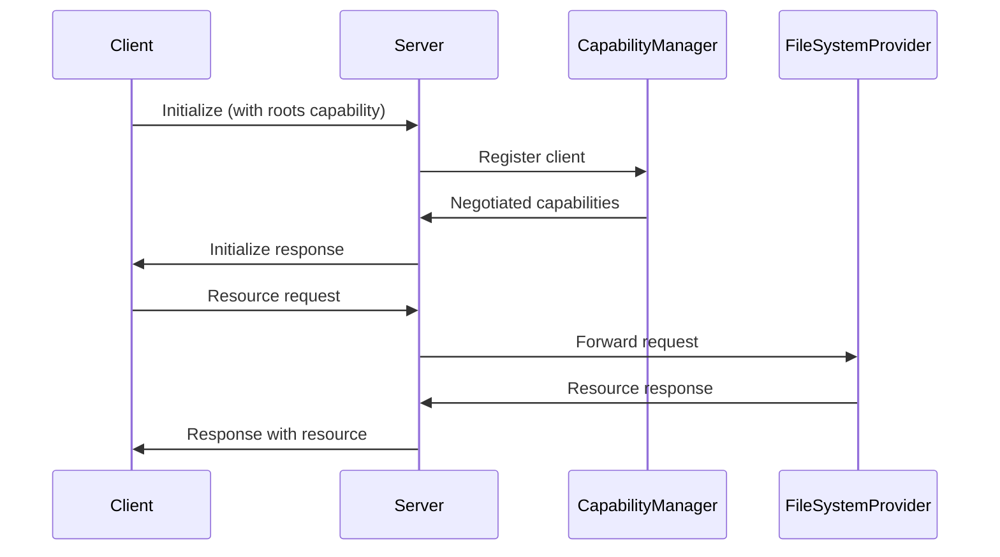
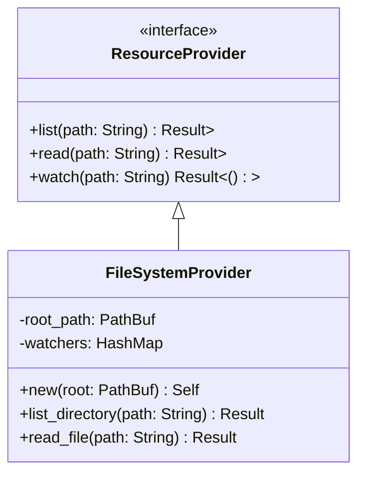

# Pylon Development Handoff

## Project Status

### Completed Components

1. **WebSocket Server (Complete)**
   - Location: `src-tauri/src/mcp/server.rs`
   - Features:
     - Connection handling
     - Client ID tracking
     - Heartbeat monitoring
     - Message routing

2. **MCP Protocol Types (Complete)**
   - Location: `src-tauri/src/mcp/types.rs`
   - Implements:
     - All core MCP types
     - JSON-RPC message types
     - Serialization/deserialization
     - Full Clone support

3. **Protocol Handler (Complete)**
   - Location: `src-tauri/src/mcp/protocol.rs`
   - Features:
     - Message parsing
     - Initialization handling
     - Error responses
     - Basic tests

4. **Capability Manager (Complete)**
   - Location: `src-tauri/src/mcp/capabilities.rs`
   - Features:
     - Client state tracking
     - Capability negotiation
     - Dynamic updates
     - Comprehensive tests

### Current Project Structure
```
pylon/
├── src-tauri/
│   ├── src/
│   │   ├── mcp/
│   │   │   ├── mod.rs              # Module exports
│   │   │   ├── server.rs           # WebSocket server
│   │   │   ├── types.rs            # MCP protocol types
│   │   │   ├── protocol.rs         # Protocol handler
│   │   │   └── capabilities.rs      # Capability management
│   │   ├── tests/
│   │   │   └── mcp/
│   │   │       ├── mod.rs
│   │   │       └── server_tests.rs
│   │   ├── lib.rs
│   │   └── main.rs
│   └── Cargo.toml
└── docs/
    ├── log.md                      # Development history
    ├── todo.md                     # Task tracking
    └── handoff.md                  # This document
```

### Dependencies
```toml
[dependencies]
tauri = { version = "2", features = [] }
tauri-plugin-shell = "2"
serde = { version = "1", features = ["derive"] }
serde_json = "1"
tokio = { version = "1.42.0", features = ["full"] }
tokio-tungstenite = "0.24.0"
jsonrpc-core = "18.0.0"
actix-web = "4.9.0"
actix-ws = "0.3.0"
futures-util = "0.3.31"
env_logger = "0.11.5"
log = "0.4.22"
uuid = { version = "1.7.0", features = ["v4", "serde"] }
```

## Next Steps

### 1. File System Provider Implementation
The next immediate task is implementing the file system provider. This will be the first concrete feature demonstrating the full MCP protocol flow.

#### Create New Files
1. **Resource Provider Interface**
```rust
// src-tauri/src/mcp/providers/mod.rs
pub trait ResourceProvider {
    fn list(&self, path: &str) -> Result<Vec<Resource>, Error>;
    fn read(&self, path: &str) -> Result<Vec<u8>, Error>;
    fn watch(&self, path: &str) -> Result<(), Error>;
}
```

2. **File System Provider**
```rust
// src-tauri/src/mcp/providers/filesystem.rs
pub struct FileSystemProvider {
    root_path: PathBuf,
    watchers: Arc<RwLock<HashMap<String, notify::RecommendedWatcher>>>,
}
```

#### Implementation Tasks
1. **Basic Provider**
   - [ ] Create resource provider trait
   - [ ] Implement basic file system provider
   - [ ] Add path validation and security checks
   - [ ] Implement error handling

2. **File Operations**
   - [ ] Directory listing
   - [ ] File reading
   - [ ] Path normalization
   - [ ] Access control

3. **Change Notifications**
   - [ ] File system watcher setup
   - [ ] Change event handling
   - [ ] Notification dispatch
   - [ ] Watcher cleanup

4. **Integration**
   - [ ] Connect to capability manager
   - [ ] Add to protocol handler
   - [ ] Implement resource messages
   - [ ] Update server handler

### 2. Testing Requirements

1. **Unit Tests**
```rust
#[cfg(test)]
mod tests {
    use super::*;
    use tempfile::TempDir;

    #[test]
    fn test_directory_listing() {
        let temp = TempDir::new().unwrap();
        let provider = FileSystemProvider::new(temp.path());
        // Test implementation
    }
}
```

2. **Integration Tests**
   - Full protocol flow testing
   - Capability negotiation verification
   - Change notification testing
   - Error handling scenarios

### 3. Required Dependencies
Add to Cargo.toml:
```toml
[dependencies]
notify = "6.1"
tempfile = { version = "3.10", features = ["fastrand"] }
```

## Architecture Details

### 1. Capability Flow


### 2. Resource Provider Architecture


## Testing Strategy

### 1. Unit Tests
- File operations
- Path validation
- Access control
- Watcher functionality

### 2. Integration Tests
- Full protocol flow
- Capability negotiation
- Change notifications
- Error scenarios

### 3. Performance Tests
- Large directory listings
- File reading performance
- Watcher scalability

## Security Considerations

1. **Path Validation**
   - Prevent path traversal
   - Validate file access
   - Check permissions

2. **Resource Limits**
   - Max file size
   - Directory depth
   - Number of watchers

3. **Access Control**
   - Root path restrictions
   - File type limitations
   - Write protection

## Error Handling

1. **File System Errors**
```rust
#[derive(Debug, Error)]
pub enum FileSystemError {
    #[error("Path not found: {0}")]
    NotFound(String),
    #[error("Access denied: {0}")]
    AccessDenied(String),
    #[error("Invalid path: {0}")]
    InvalidPath(String),
}
```

2. **Recovery Strategies**
   - Watcher reconnection
   - Path normalization
   - Resource cleanup

## Documentation Requirements

1. **Code Documentation**
   - Full API documentation
   - Example usage
   - Error handling guide

2. **Integration Guide**
   - Setup instructions
   - Configuration options
   - Security guidelines

## Metrics and Monitoring

1. **Performance Metrics**
   - Response times
   - Resource usage
   - Watcher events

2. **Error Tracking**
   - Error rates
   - Common failures
   - Recovery success

## Future Considerations

1. **Extensibility**
   - Additional providers
   - Enhanced capabilities
   - Protocol extensions

2. **Performance**
   - Caching strategies
   - Batch operations
   - Optimization opportunities

This handoff document should provide everything needed to continue development of the file system provider and subsequent features. The immediate focus should be on implementing the file system provider while maintaining the established patterns for capability negotiation and protocol handling.