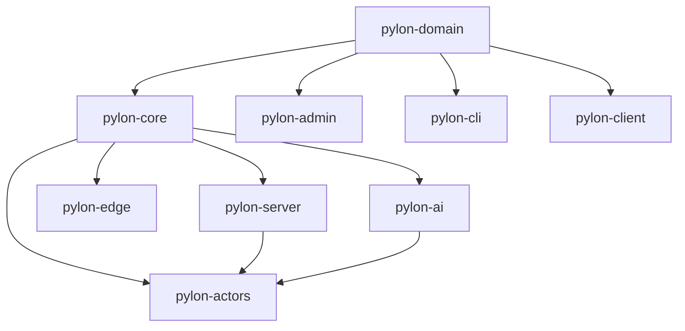

# Pylon Package Architecture

This document outlines the optimal package structure for Pylon, a comprehensive Nostr relay implementation designed for the OpenAgents AI ecosystem.

## Overview

Pylon is architected as a modular monorepo with packages designed around deployment scenarios, functional domains, and reusability. The architecture supports everything from high-performance cloud relays serving millions of users to lightweight embedded relays running offline in hostile environments.

## Core Architecture Principles

1. **Domain-Driven Design** - Business logic separated from infrastructure
2. **Contract-First Development** - API contracts defined before implementations  
3. **Multi-Deployment Support** - Same codebase, multiple deployment targets
4. **Effect Services Pattern** - Composable, testable services with dependency injection
5. **Actor-Based Concurrency** - Rivet actors for stateful connection management
6. **Provider-Agnostic AI** - Effect AI abstractions for LLM interactions

## Package Structure

### Core Foundation

#### `@openagentsinc/pylon-domain`
**Purpose**: Defines Nostr protocol schemas, NIP implementations, and shared contracts.

**Contains**:
- **Nostr Event Schemas**: All event kinds (0-40000+) with validation
- **NIP Implementations**: Core NIPs (01, 02, 09, 11, 13, 17, 28, 42, 45, etc.)
- **WebSocket Message Types**: REQ, EVENT, OK, EOSE, CLOSED, NOTICE, COUNT
- **Filter Schemas**: Complete NIP-01 filter validation and types
- **Error Types**: EventNotFound, AuthRequired, RateLimited, etc.
- **Branded Types**: EventId, PubKey, Signature for type safety

**Key Benefits**:
- Single source of truth for Nostr protocol compliance
- Shared contracts ensure server/client consistency
- Type-safe NIPs prevent protocol violations

#### `@openagentsinc/pylon-core`
**Purpose**: Core relay engine with EffectTS services - the heart of Pylon.

**Contains**:
- **EventService**: Event validation, processing, storage orchestration
- **SubscriptionService**: Client subscription management and event matching
- **FilterService**: NIP-01 filter logic with optimization for large datasets
- **AuthService**: NIP-42 authentication and authorization
- **SecurityService**: Rate limiting, PoW validation, spam detection
- **ReputationService**: Pubkey reputation tracking and scoring
- **ConfigService**: Relay configuration management
- **StorageService**: Abstract interface for PostgreSQL/pglite
- **BroadcastService**: Real-time event distribution to subscribers

**Architecture Pattern**:
```typescript
// Example service composition
const RelayLayer = Layer.mergeAll(
  EventService.Default,
  SubscriptionService.Default,
  FilterService.Default,
  AuthService.Default,
  SecurityService.Default
)
```

### Deployment Implementations

#### `@openagentsinc/pylon-server`
**Purpose**: Full-scale cloud relay with PostgreSQL backend.

**Contains**:
- **WebSocket Server**: High-performance WS connection handling
- **PostgreSQL Integration**: Full schema with optimized indexes
- **Database Migrations**: Schema versioning and upgrades
- **Connection Pooling**: Efficient database resource management
- **Health Checks**: Monitoring endpoints for load balancers
- **Metrics Export**: Prometheus/OpenTelemetry integration

**Deployment Targets**:
- Multi-region cloud infrastructure
- 10M+ concurrent users
- Managed PostgreSQL with read replicas
- Kubernetes/Docker orchestration

#### `@openagentsinc/pylon-edge`
**Purpose**: Lightweight relay using pglite for edge/embedded scenarios.

**Contains**:
- **pglite Integration**: WASM PostgreSQL (~3MB bundle)
- **Local Storage**: IndexedDB (web) / filesystem (native)
- **Sync Protocols**: Efficient relay-to-relay synchronization
- **Compression**: zstd dictionary compression (30-70% reduction)
- **Offline Queue**: Event queuing for network interruptions
- **Bandwidth Optimization**: Delta sync, selective filtering

**Deployment Targets**:
- Rivet edge nodes (50+ global locations)
- Embedded in Commander/Onyx applications
- Community/organizational relays
- Hostile environment deployments (Tor/I2P)

#### `@openagentsinc/pylon-actors`
**Purpose**: Rivet actor implementations for distributed connection management.

**Contains**:
- **ClientConnectionActor**: Individual WebSocket connection lifecycle
- **SubscriptionMatcherActor**: Efficient event-to-subscription matching
- **EventProcessorActor**: Parallel event validation and storage
- **DVMRouterActor**: NIP-90 Data Vending Machine job routing
- **RelayCoordinatorActor**: Inter-relay communication for resilience
- **RateLimitActor**: Distributed rate limiting across nodes

**Actor Pattern Example**:
```typescript
export class ClientConnectionActor extends Actor<ConnectionState> {
  async handleMessage(message: NostrMessage) {
    switch (message[0]) {
      case "EVENT": return this.handleEvent(message[1])
      case "REQ": return this.handleSubscription(message[1], message.slice(2))
      case "CLOSE": return this.handleClose(message[1])
    }
  }
}
```

### Specialized Features

#### `@openagentsinc/pylon-ai`
**Purpose**: AI agent integration and LLM-powered features.

**Contains**:
- **DVM Implementation**: Complete NIP-90 Data Vending Machine support
- **AI Agent Coordination**: Custom event kinds for agent swarms
- **Effect AI Integration**: Provider-agnostic LLM interactions
- **Intelligent Filtering**: ML-based spam detection
- **Content Analysis**: Automated content moderation
- **Predictive Caching**: AI-driven content prefetching

**AI Integration Example**:
```typescript
const SpamDetector = Effect.gen(function*() {
  const ai = yield* AiLanguageModel
  const analysis = yield* ai.generateText({
    prompt: `Analyze if this is spam: ${content}`,
    schema: SpamAnalysisSchema
  })
  return analysis.isSpam
})
```

#### `@openagentsinc/pylon-admin`
**Purpose**: Administrative interface and operational tools.

**Contains**:
- **Admin Dashboard**: Real-time relay monitoring interface
- **Configuration Management**: Dynamic relay configuration
- **Moderation Tools**: Content filtering and user management
- **Analytics**: Event statistics and performance metrics
- **Backup/Restore**: Automated data protection
- **Emergency Controls**: Circuit breakers and emergency shutdowns

### Development & Client Tools

#### `@openagentsinc/pylon-cli`
**Purpose**: Command-line tools for development and operations.

**Contains**:
- **Relay Management**: Start, stop, configure relay instances
- **Event Testing**: Generate and validate test events
- **NIP Compliance**: Validate relay NIP implementations
- **Performance Testing**: Load testing and benchmarking
- **Migration Tools**: Database schema migrations
- **Debug Tools**: Connection tracing and event inspection

#### `@openagentsinc/pylon-client`
**Purpose**: TypeScript client library for applications.

**Contains**:
- **Relay Client**: Type-safe WebSocket connection management
- **Event Builder**: Helpers for creating valid Nostr events
- **Subscription Manager**: Efficient subscription lifecycle
- **Connection Pool**: Multi-relay connection management
- **Offline Support**: Event queuing and synchronization
- **React Hooks**: Frontend integration helpers

## Package Dependencies



## Implementation Strategy

### Phase 1: Foundation (MVP)
1. **pylon-domain** - Core NIPs (01, 02, 09, 11, 42)
2. **pylon-core** - Basic services (Event, Subscription, Filter)
3. **pylon-server** - WebSocket server with PostgreSQL
4. **pylon-cli** - Basic testing tools

### Phase 2: Scale & Performance
1. **pylon-actors** - Rivet integration for massive scale
2. **pylon-edge** - pglite implementation for edge deployment
3. Enhanced NIPs in **pylon-domain** (13, 17, 28, 45, 50)

### Phase 3: AI & Advanced Features
1. **pylon-ai** - NIP-90 DVM and AI agent coordination
2. **pylon-admin** - Monitoring and management interface
3. **pylon-client** - Developer-friendly client library

### Phase 4: Ecosystem & Polish
1. Advanced NIPs (59, 65, 89, 94, 98)
2. Plugin system for custom NIPs
3. Enhanced security and privacy features

## Key Architectural Benefits

### Modularity
- **Mix & Match**: Use server + actors for cloud, or edge alone for embedded
- **Independent Evolution**: Packages can be versioned and released separately
- **Testing**: Each package can be unit tested in isolation

### Reusability  
- **Shared Domain**: Same event schemas across all implementations
- **Service Composition**: Core services work with any storage backend
- **Cross-Platform**: Edge package works in Node.js, browsers, and mobile

### Scalability
- **Horizontal**: Actors distribute across thousands of Rivet nodes
- **Vertical**: Server package optimized for high-performance hardware
- **Global**: Edge packages provide low-latency worldwide access

### Developer Experience
- **Type Safety**: End-to-end TypeScript with branded types
- **Contract-First**: API changes automatically propagate
- **Effect Benefits**: Structured concurrency, error handling, testability

This architecture positions Pylon as the definitive Nostr relay implementation, capable of scaling from personal embedded relays to global infrastructure serving 100 million users while maintaining the OpenAgents focus on AI agent coordination and privacy.